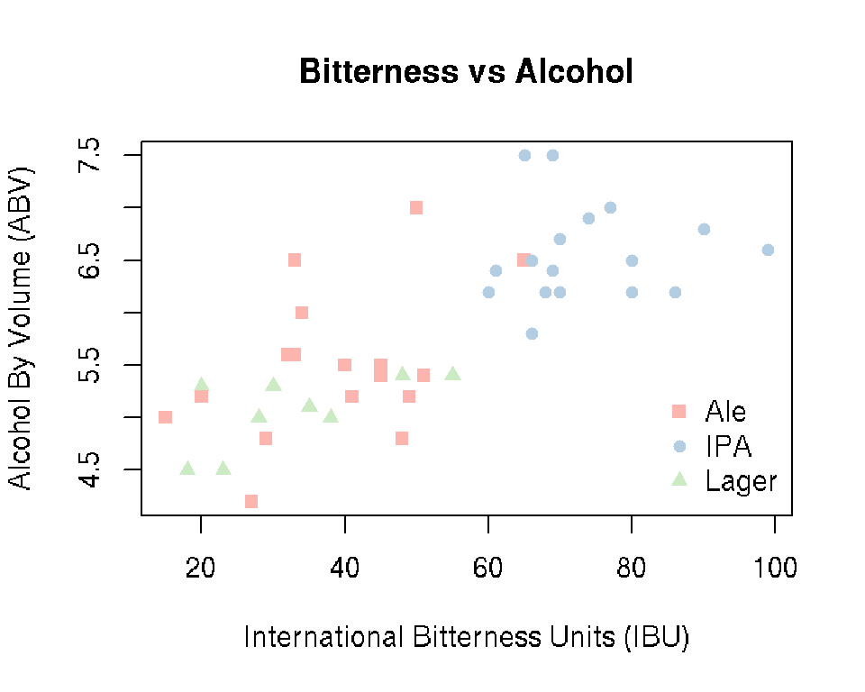

# Simple Statistics in R

*Author: Nathaniel E. Helwig*


## Chapter Outline and Goals

In this chapter, we will cover how to...

* Load, explore, and summarize data
* Calculate descriptive statistics
* Create reproducible plots and tables
* Perform one and two sample *t*-tests
* Fit one-way analysis of variance models
* Conduct simple correlation tests

R has many helpful functions for simple descriptive and inferential statistics, which make reproducible research easy!


## Minnesota Beer Data

### Overview

The Minnesota beer data has 44 beers measured on 7 variables: 

1) *Brewery*: Name of the brewery (**factor** with 8 levels)
2) *Beer*: Name of the beer (**factor** with 44 levels)
3) *Description*: Description of the beer (**factor** with 37 levels)
4) *Style*: Style of the beer (**factor** with 3 levels)
5) *ABV*: Alcohol by volume (**numeric**)
6) *IBU*: International bitterness units (**integer**)
7) *Rating*: Beer Advocate rating (**integer**)

Data obtained by NEH from [Beer Advocate](http://beeradvocate.com) and the websites of the eight breweries.

### Load the Data

Use the **read.csv** function to load the *beer* data into R

```r
beer <- read.csv("http://users.stat.umn.edu/~helwig/notes/MNbeer.csv")
```

The **dim** function returns the number of rows and columns of the data frame

```r
dim(beer)
```

```
## [1] 44  7
```
The *beer* data frame has 44 beers (rows) measured on 7 variables (columns). 

The **names** function returns the names of the variables in a data frame

```r
names(beer)
```

```
## [1] "Brewery"     "Beer"        "Description" "Style"       "ABV"        
## [6] "IBU"         "Rating"
```


### Look at the Data

The **head** function returns the first six lines of a data frame

```r
head(beer)
```

```
##       Brewery         Beer              Description Style ABV IBU Rating
## 1     Bauhaus  Wonderstuff     New Bohemian Pilsner Lager 5.4  48     88
## 2     Bauhaus    Stargazer German Style Schwarzbier Lager 5.0  28     87
## 3     Bauhaus  Wagon Party    West Cost Style Lager Lager 5.4  55     86
## 4     Bauhaus    Sky-Five!        Midwest Coast IPA   IPA 6.7  70     86
## 5 Bent Paddle         Kanu         Session Pale Ale   Ale 4.8  48     85
## 6 Bent Paddle Venture Pils            Pilsner Lager Lager 5.0  38     87
```

The **summary** function provides a summary of each variable in a data frame

```r
summary(beer)
```

```
##           Brewery                Beer                    Description
##  Indeed       :7   14* ESB         : 1   India Pale Ale        : 5  
##  Summit       :7   B-Side Pils     : 1   English IPA           : 2  
##  Surly        :7   Batch 300       : 1   Pilsner Lager         : 2  
##  Bent Paddle  :5   Bender          : 1   Porter                : 2  
##  Fulton       :5   Bent Hop        : 1   American Blonde Ale   : 1  
##  Urban Growler:5   Big Boot Rye IPA: 1   Belgian Style Pale Ale: 1  
##  (Other)      :8   (Other)         :38   (Other)               :31  
##    Style         ABV             IBU            Rating     
##  Ale  :18   Min.   :4.200   Min.   :15.00   Min.   :79.00  
##  IPA  :17   1st Qu.:5.200   1st Qu.:33.00   1st Qu.:85.00  
##  Lager: 9   Median :5.600   Median :48.50   Median :87.00  
##             Mean   :5.818   Mean   :51.07   Mean   :87.18  
##             3rd Qu.:6.500   3rd Qu.:68.25   3rd Qu.:90.00  
##             Max.   :7.500   Max.   :99.00   Max.   :98.00  
## 
```

### Plot the Data

The **brewer.pal** function in the *RColorBrewer* package creates [ColorBrewer palettes](http://ColorBrewer.org) for plotting

```r
library(RColorBrewer)
MyColors <- brewer.pal(nlevels(beer$Style), "Pastel1")
```

The **boxplot** function creates simple boxplots

```r
boxplot(ABV ~ Style, data = beer, ylab = "Alcohol By Volume (ABV)",
        main = "Alcohol by Style of Beer", col = MyColors)
```


The **plot** function creates generic X-Y scatterplots

```r
StyleInt <- as.integer(beer$Style)
plot(beer$IBU, beer$ABV, xlab = "International Bitterness Units (IBU)",
     ylab = "Alcohol By Volume (ABV)", pch = StyleInt + 14,
     main = "Bitterness vs Alcohol", col = MyColors[StyleInt])
legend("bottomright", legend = levels(beer$Style), pch = 15:17,
       col = MyColors, bty = "n")
```



R has functions for saving plots to various figure formats:

* **bmp** function for bitmap graphics
* **jpeg** function for JPEG graphics
* **png** function for Portable Network Graphics
* **tiff** function for Tag Image File Format graphics
* **pdf** or **dev.copy2pdf** functions for Portable Document Format graphics
* **postscript** or **dev.copy2eps** functions for PostScript graphics


## Descriptive Statistics in R

### Overview
We often need to calculate simple descriptive statistics of variables in a data frame, e.g., to make summary tables. As we have already seen, R is a function based and object oriented programming language. To obtain descriptive statistics, we input an object (e.g., column of a data frame) into the corresponding function. Thankfully, functions in R often have intuitive names---you can typically guess the name of the function you need!


### Minimum and Maximum

To calculate the minimum or maximum of a variable, we could use the **min** or **max** functions

```r
min(beer$ABV)
```

```
## [1] 4.2
```

```r
max(beer$ABV)
```

```
## [1] 7.5
```
or the **range** function to return both the minimum and maximum

```r
range(beer$ABV)
```

```
## [1] 4.2 7.5
```
The minimum ABV in the sample is 4.2% and the maximum is 7.5%. To determine which beers have the min/max ABV values, we can use the **which.min** and **which.max** functions

```r
minmaxID <- c(which.min(beer$ABV), which.max(beer$ABV))
beer[minmaxID,]
```

```
##    Brewery              Beer      Description Style ABV IBU Rating
## 12  Indeed Lucy Session Sour Session Sour Ale   Ale 4.2  27     86
## 38   Surly         Overrated   West Coast IPA   IPA 7.5  69     91
```

### Mean, Standard Deviation, and Variance

The **mean** function calculates the sample mean $\bar{x} = \frac{1}{n}\sum_{i=1}^n x_i$

```r
mean(beer$ABV)
```

```
## [1] 5.818182
```

The **sd** function calculates the sample standard deviation $s = \{\frac{1}{n-1} \sum_{i=1}^n (x_i - \bar{x})^2\}^{1/2}$ 

```r
sd(beer$ABV)
```

```
## [1] 0.8176178
```

The **var** function calculates the sample variance $s^2 = \frac{1}{n-1} \sum_{i=1}^n (x_i - \bar{x})^2$

```r
var(beer$ABV)
```

```
## [1] 0.6684989
```
The mean ABV is about 5.82% with a standard deviation of about 0.82% (variance of about 0.67%). 

### Medians and Quantiles

The **median** function calculates the sample median of a vector

```r
median(beer$ABV)
```

```
## [1] 5.6
```
and the **quantile** function can be used for other quantiles

```r
quantile(beer$ABV)
```

```
##   0%  25%  50%  75% 100% 
##  4.2  5.2  5.6  6.5  7.5
```

```r
quantile(beer$ABV, probs = seq(0, 1, length=11))
```

```
##   0%  10%  20%  30%  40%  50%  60%  70%  80%  90% 100% 
## 4.20 4.86 5.16 5.30 5.42 5.60 6.20 6.40 6.50 6.87 7.50
```
The median is 5.6% ABV, which implies that half of the beers have at least 5.6% ABV. 

### Factor Level Information

The **levels** function extracts the levels (i.e., unique values) of a factor variable

```r
levels(beer$Style)
```

```
## [1] "Ale"   "IPA"   "Lager"
```
and the **nlevels** function returns the number of levels of a factor

```r
nlevels(beer$Style)
```

```
## [1] 3
```
The 44 beers are classified into one of three Styles: Ale, IPA, or Lager.

### Covariances and Correlations

The **cov** function calculates the covariance $c = \frac{1}{n-1} \sum_{i=1}^n (x_i - \bar{x})(y_i - \bar{y})$ between two variables

```r
cov(beer$ABV, beer$IBU)
```

```
## [1] 13.22664
```
or a covariance matrix between the columns of an input data frame

```r
cov(beer[, c("ABV","IBU","Rating")])
```

```
##               ABV       IBU    Rating
## ABV     0.6684989  13.22664  1.510571
## IBU    13.2266385 461.18129 30.871036
## Rating  1.5105708  30.87104 13.919662
```

The **cor** function calculates the correlation $r = \frac{\sum_{i=1}^n (x_i - \bar{x})(y_i - \bar{y})}{\{\sum_{i=1}^n (x_i - \bar{x})^2 \}^{1/2} \{\sum_{i=1}^n (y_i - \bar{y})^2 \}^{1/2} }$ between two variables

```r
cor(beer$ABV, beer$IBU)
```

```
## [1] 0.7532919
```
or a correlation matrix between the columns of an input data frame

```r
cor(beer[, c("ABV","IBU","Rating")])
```

```
##              ABV       IBU    Rating
## ABV    1.0000000 0.7532919 0.4951952
## IBU    0.7532919 1.0000000 0.3853018
## Rating 0.4951952 0.3853018 1.0000000
```


### Applying Functions to Multiple Variables

To apply a function to several columns, we can use the **apply** function

```r
apply(beer[, c("ABV","IBU","Rating")], 2, range)
```

```
##      ABV IBU Rating
## [1,] 4.2  15     79
## [2,] 7.5  99     98
```

```r
apply(beer[, c("ABV","IBU","Rating")], 2, mean)
```

```
##       ABV       IBU    Rating 
##  5.818182 51.068182 87.181818
```


### Applying Functions at Levels of Factors

Use the **tapply** (ragged apply) function to apply some function to a numeric variable separately at each level of a factor variable. For example, we could apply the **range** function to the *ABV* variable separately for each *Style* of beer

```r
tapply(beer$ABV, beer$Style, range)
```

```
## $Ale
## [1] 4.2 7.0
## 
## $IPA
## [1] 5.8 7.5
## 
## $Lager
## [1] 4.5 5.4
```
In the given sample, Ales range from 4.2% to 7% ABV, India Pale Ales range from 5.8% to 7.5% ABV, and Lagers range from 4.5% to 5.4% ABV.

### Making a Table

Use the **cbind** (column combine) function in combination with the **tapply** function to create tables

```r
tab1 <- cbind(tapply(beer$Rating, beer$Style, length),
              tapply(beer$ABV, beer$Style, mean),
              tapply(beer$ABV, beer$Style, sd),
              tapply(beer$IBU, beer$Style, mean),
              tapply(beer$IBU, beer$Style, sd),
              tapply(beer$Rating, beer$Style, mean),
              tapply(beer$Rating, beer$Style, sd))
colnames(tab1) <- c("n", "ABV.Mean", "ABV.SD", "IBU.Mean", 
                    "IBU.SD", "Rating.Mean", "Rating.SD")
rtab1 <- round(tab1, 2)
rtab1
```

```
##        n ABV.Mean ABV.SD IBU.Mean IBU.SD Rating.Mean Rating.SD
## Ale   18     5.49   0.67    39.00  12.28       86.83      3.50
## IPA   17     6.56   0.46    73.53  10.59       88.18      4.54
## Lager  9     5.06   0.35    32.78  12.58       86.00      1.87
```

The **write.csv** function can be used to save the table

```r
write.csv(rtab1, file = "~/Desktop/table1.csv", row.names = TRUE)
```
After some minor stylistic edits, the table is ready for publication---without having to manually type or copy-paste numbers!

The **kable** function (in the *knitr* package) includes nicely formatted tables in R Markdown documents

```r
library(knitr)
kable(rtab1, caption = "Table 1: Sample size (n) and variable means and standard deviations (SD) for each style of beer.")
```


Table: (\#tab:unnamed-chunk-26)Table 1: Sample size (n) and variable means and standard deviations (SD) for each style of beer.

          n   ABV.Mean   ABV.SD   IBU.Mean   IBU.SD   Rating.Mean   Rating.SD
------  ---  ---------  -------  ---------  -------  ------------  ----------
Ale      18       5.49     0.67      39.00    12.28         86.83        3.50
IPA      17       6.56     0.46      73.53    10.59         88.18        4.54
Lager     9       5.06     0.35      32.78    12.58         86.00        1.87


## Student's t-Test in R

### One Sample t-Test

Mass produced beers (e.g., Bud Light, Miller Lite, etc.) have 4.2% ABV. Suppose we want to test if Minnesota beers have the same mean ABV as mass produced beers
$$
H_0: \mu = 4.2 \quad \mbox{vs.} \quad H_1: \mu \neq 4.2
$$
where $\mu$ is the mean ABV, and $H_0$ and $H_1$ denote the null and alternative hypotheses. Assuming that the ABV scores are normally distributed, the **t.test** function can be used to test the null hypothesis

```r
t.test(beer$ABV, mu = 4.2)
```

```
## 
## 	One Sample t-test
## 
## data:  beer$ABV
## t = 13.128, df = 43, p-value < 2.2e-16
## alternative hypothesis: true mean is not equal to 4.2
## 95 percent confidence interval:
##  5.569603 6.066760
## sample estimates:
## mean of x 
##  5.818182
```
The observed *t* statistic is $t = 13.13$ with 43 degrees of freedom, resulting in a p-value of essentially zero---we reject $H_0$ using any standard $\alpha$ level. The sample mean is $\bar{x} = 5.8$% ABV and the 95% confidence interval for the $\mu$ (population mean ABV of Minnesota beers) is 5.6% to 6.1% ABV.

If we expect that the Minnesota beers have higher ABV than mass produced beers, i.e.,
$$
H_0: \mu = 4.2 \quad \mbox{vs.} \quad H_1: \mu > 4.2
$$
we need to adjust the *alternative* input 

```r
t.test(beer$ABV, mu = 4.2, alternative = "greater")
```

```
## 
## 	One Sample t-test
## 
## data:  beer$ABV
## t = 13.128, df = 43, p-value < 2.2e-16
## alternative hypothesis: true mean is greater than 4.2
## 95 percent confidence interval:
##  5.610972      Inf
## sample estimates:
## mean of x 
##  5.818182
```
The only noteworthy difference is that the confidence interval is now a 95% lower bound for the mean ABV of Minnesota beers, which we expect to be at least 5.6% ABV. Note that changing the alternative also changes the p-value, but for this example we do not notice (because the p-value is so small).

### Two Sample t-Test

Suppose that we want to test if IPA beers have higher ABV than non-IPAs (Ales and Lagers)
$$
H_0: \mu_1 = \mu_2 \quad \mbox{vs.} \quad H_1: \mu_1 > \mu_2
$$
where $\mu_1$ and $\mu_2$ denote the mean ABV of IPA and non-IPA beers, respectively.

To use the **t.test** function for a two sample *t*-test, we need to input two vectors

```r
beer$IPA <- (beer$Style == "IPA")
t.test(beer$ABV[beer$IPA], beer$ABV[!beer$IPA], alternative = "greater")
```

```
## 
## 	Welch Two Sample t-test
## 
## data:  beer$ABV[beer$IPA] and beer$ABV[!beer$IPA]
## t = 7.4454, df = 40.527, p-value = 2.093e-09
## alternative hypothesis: true difference in means is greater than 0
## 95 percent confidence interval:
##  0.9415048       Inf
## sample estimates:
## mean of x mean of y 
##  6.564706  5.348148
```
The observed *t* statistic is $t = 7.45$ with 40.53 degrees of freedom, resulting in a p-value of essentially zero---we reject $H_0$ using any standard $\alpha$ level. The sample mean difference is $\bar{x}_1 - \bar{x}_2 = 1.22$% ABV and the 95% lower-bound confidence interval reveals that we expect IPAs to have at least 0.94% more ABV than non-IPAs.

The default uses the Welch version, which does not assume equal variance for the two groups. The *var.equal* input can be used to change this assumption, which produces the classic two sample *t*-test

```r
t.test(beer$ABV[beer$IPA], beer$ABV[!beer$IPA], alternative = "greater",
       var.equal = TRUE)
```

```
## 
## 	Two Sample t-test
## 
## data:  beer$ABV[beer$IPA] and beer$ABV[!beer$IPA]
## t = 6.9809, df = 42, p-value = 7.74e-09
## alternative hypothesis: true difference in means is greater than 0
## 95 percent confidence interval:
##  0.9234437       Inf
## sample estimates:
## mean of x mean of y 
##  6.564706  5.348148
```
Note that the observed *t*-test statistic, p-value, and 95% lower-bound are slightly different, but our conclusion does not change: we expect IPAs to have at least 0.9% more ABV than non-IPAs.

## One-Way ANOVA in R

### Omnibus F-Test

Extending the previous example, suppose that we want to test if the mean ABV differs for the three Styles of beer
$$
H_0: \mu_j = \mu  \mbox{ for all } j \quad \mbox{vs.} \quad H_1: \mu_j \neq \mu \mbox{ for some } j
$$
where $\mu_j$ denotes the mean ABV of the three Styles of beer: Ales, IPAs, and Lagers. Assuming that the ABV scores a normally distributed, we can use the **aov** (analysis of variance) function


```r
amod <- aov(ABV ~ Style, data = beer)
summary(amod)
```

```
##             Df Sum Sq Mean Sq F value   Pr(>F)    
## Style        2  16.59   8.297      28 2.16e-08 ***
## Residuals   41  12.15   0.296                     
## ---
## Signif. codes:  0 '***' 0.001 '**' 0.01 '*' 0.05 '.' 0.1 ' ' 1
```
The observed *F* statistic is $F = 28$ with 2 numerator and 41 denominator degrees of freedom, resulting in a p-value of essentially zero---we reject $H_0$ using any standard $\alpha$ level. We conclude that the mean ABV of Minnesota beers depends on the Style of beer, but the results do not directly reveal which Styles significantly differ from one another.


### Pairwise Comparisons (Tukey's HSD)

To determine which Styles significantly differ in their mean ABV, we can use Tukey's Honest Significant Differences (HSD) procedure via the **TukeyHSD** function


```r
TukeyHSD(amod)
```

```
##   Tukey multiple comparisons of means
##     95% family-wise confidence level
## 
## Fit: aov(formula = ABV ~ Style, data = beer)
## 
## $Style
##                 diff        lwr        upr     p adj
## IPA-Ale    1.0702614  0.6225693  1.5179536 0.0000024
## Lager-Ale -0.4388889 -0.9793078  0.1015301 0.1313124
## Lager-IPA -1.5091503 -2.0548418 -0.9634589 0.0000001
```
The pairwise comparisons reveal that

* IPAs have significantly higher mean ABV than Ales. The estimated mean difference is $\hat{\delta}_1 = \hat{\mu}_{2} - \hat{\mu}_1 = 1.07$ with 95% confidence interval $\delta_1 \in [0.62, 1.52]$.
* Lagers and Ales do not significantly differ in mean ABV. The estimated mean difference is $\hat{\delta}_2 = \hat{\mu}_{3} - \hat{\mu}_1 = -0.44$ with 95% confidence interval $\delta_2 \in [-0.98, 0.10]$.
* Lagers have significantly lower mean ABV than IPAs. The estimated mean difference is $\hat{\delta}_3 = \hat{\mu}_{3} - \hat{\mu}_2 = -1.51$ with 95% confidence interval $\delta_3 \in [-2.05, -0.96]$.

## Correlation Tests in R

Suppose that we want to test if a beer's ABV and Rating are postively correlated
$$
H_0: \rho = 0 \quad \mbox{vs.} \quad H_1: \rho > 0
$$
where $\rho$ is the population correlation between the ABV and Rating. Assuming that the ABV and Rating variables follow a bivariate normal distribution, we can use the **cor.test** function

```r
cor.test(beer$ABV, beer$Rating, alternative = "greater")
```

```
## 
## 	Pearson's product-moment correlation
## 
## data:  beer$ABV and beer$Rating
## t = 3.6939, df = 42, p-value = 0.000316
## alternative hypothesis: true correlation is greater than 0
## 95 percent confidence interval:
##  0.2784833 1.0000000
## sample estimates:
##       cor 
## 0.4951952
```
The estimated sample correlation is $r = 0.495$ and the 95% lower-bound confidence interval reveals that we expect the ABV and Ratings to have a positive correlation of at least  $\rho = 0.28$.


## Exercises

1) Load the Minnesota Beer Data into R.
2) Make a boxplot of the IBUs by Style of beer.
3) Make a scatterplot of the ABV (x-axis) by Rating (y-axis).
4) Calculate some descriptive statistics for the IBU variable.
5) Create a table showing the sample size and variable means and standard deviations for each Brewery.
6) Repeat the *t*-tests using the IBU variable as the response.
7) Repeat the one-way ANOVA using the IBU variable as the response.
8) Repeat the correlation test using the IBU and Rating variables.
