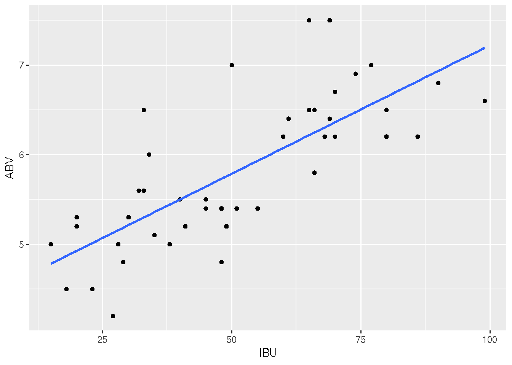
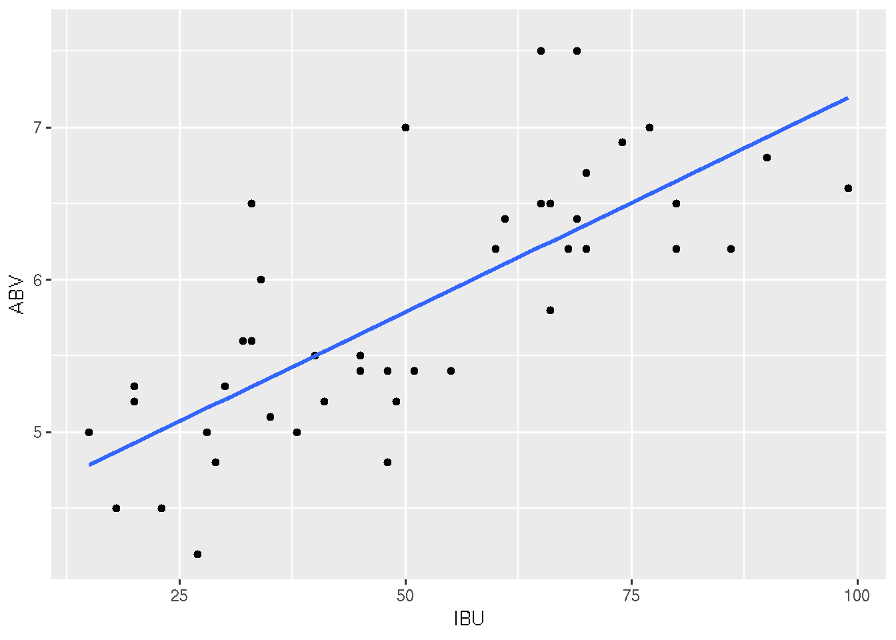
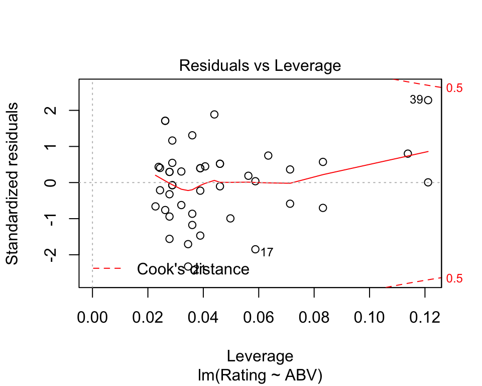
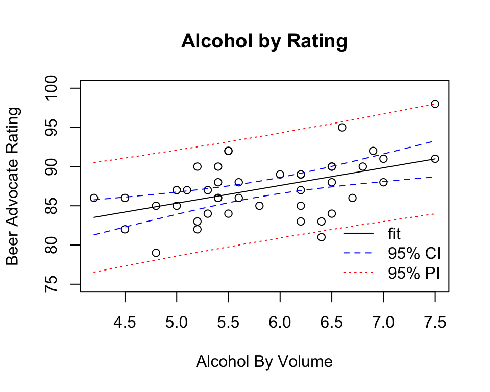

# Linear Regression in R

*Author: Nathaniel E. Helwig*


## Chapter Outline and Goals

In this chapter, we will cover how to...

* Fit simple and multiple linear regression models
* Test the significance of regression coefficients
* Plot and interpret the regression results
* Make predictions from fit regression models

R's **lm** (linear model) function will be the primary tool used in the chapter.


## Minnesota Beer Data (Reminder)

### Overview

The Minnesota beer data has 44 beers measured on 7 variables: 

1) *Brewery*: Name of the brewery (**factor** with 8 levels)
2) *Beer*: Name of the beer (**factor** with 44 levels)
3) *Description*: Description of the beer (**factor** with 37 levels)
4) *Style*: Style of the beer (**factor** with 3 levels)
5) *ABV*: Alcohol by volume (**numeric**)
6) *IBU*: International bitterness units (**integer**)
7) *Rating*: Beer Advocate rating (**integer**)

Data obtained by NEH from [Beer Advocate](http://beeradvocate.com) and the websites of the eight breweries.

### Load and Look at the Data

Use the **read.csv** function to load the *beer* data into R

```r
beer <- read.csv("http://users.stat.umn.edu/~helwig/notes/MNbeer.csv")
```


The **head** function returns the first six lines of a data frame

```r
head(beer)
```

```
##       Brewery         Beer              Description Style ABV IBU Rating
## 1     Bauhaus  Wonderstuff     New Bohemian Pilsner Lager 5.4  48     88
## 2     Bauhaus    Stargazer German Style Schwarzbier Lager 5.0  28     87
## 3     Bauhaus  Wagon Party    West Cost Style Lager Lager 5.4  55     86
## 4     Bauhaus    Sky-Five!        Midwest Coast IPA   IPA 6.7  70     86
## 5 Bent Paddle         Kanu         Session Pale Ale   Ale 4.8  48     85
## 6 Bent Paddle Venture Pils            Pilsner Lager Lager 5.0  38     87
```


## Simple Linear Regression

### Fit the Model

Consider a simple linear regression model of the form
\[
y_i = \beta_0 + \beta_1 x_i + \epsilon_i
\]
where $y_i$ is the Rating of the *i*-th beer (response), $x_i$ is the ABV of the *i*-th beer (predictor), $\beta_0$ is the unknown regression intercept, $\beta_1$ is the unknown regression slope, and $\epsilon_i \sim \mathrm{N}(0, \sigma^2)$ is a latent Gaussian error term. To fit the model, we can use the **lm** function

```r
mod <- lm(Rating ~ ABV, data = beer)
```
The first input is the regression formula (Response ~ Predictor), and the second input is the data frame containing the variables in the regression formula. Note that *mod* is an object of class *lm*, which is a list containing information about the fit model. 

```r
class(mod)
```

```
## [1] "lm"
```

```r
names(mod)
```

```
##  [1] "coefficients"  "residuals"     "effects"       "rank"         
##  [5] "fitted.values" "assign"        "qr"            "df.residual"  
##  [9] "xlevels"       "call"          "terms"         "model"
```
For example, the *$coefficients* element contains the estimated regression coefficients

```r
mod$coefficients
```

```
## (Intercept)         ABV 
##   74.034788    2.259646
```
which reveal that the expected Rating increases by about 2.26 points for every 1 unit (i.e., 1%) increaese in ABV.

### Inference Information

To obtain a more detailed summary of the fit model, use the **summary** function

```r
modsum <- summary(mod)
names(modsum)
```

```
##  [1] "call"          "terms"         "residuals"     "coefficients" 
##  [5] "aliased"       "sigma"         "df"            "r.squared"    
##  [9] "adj.r.squared" "fstatistic"    "cov.unscaled"
```

```r
modsum
```

```
## 
## Call:
## lm(formula = Rating ~ ABV, data = beer)
## 
## Residuals:
##     Min      1Q  Median      3Q     Max 
## -7.4965 -2.1563  0.3593  1.6670  7.0179 
## 
## Coefficients:
##             Estimate Std. Error t value Pr(>|t|)    
## (Intercept)  74.0348     3.5933  20.604  < 2e-16 ***
## ABV           2.2596     0.6117   3.694 0.000632 ***
## ---
## Signif. codes:  0 '***' 0.001 '**' 0.01 '*' 0.05 '.' 0.1 ' ' 1
## 
## Residual standard error: 3.28 on 42 degrees of freedom
## Multiple R-squared:  0.2452,	Adjusted R-squared:  0.2272 
## F-statistic: 13.65 on 1 and 42 DF,  p-value: 0.000632
```
Note that summarizing an *lm* object returns the estimated error standard deviation *sigma* ($\hat{\sigma}  = 3.28$), the coefficient of determination *r.squared* ($R^2 = 0.2452$), and a *coefficient* inference table for testing $H_0: \beta_j = 0$ versus $H_1: \beta_j \neq 0$. The observed *t* statistic for testing the slope parameter is $t = 3.69$ with 42 degrees of freedom, resulting in a p-value less than 0.001---we reject $H_0$ using any standard $\alpha$ level.

Use the **confint** function to obtain confidence intervals for regression coefficients

```r
confint(mod, "ABV")
```

```
##        2.5 %   97.5 %
## ABV 1.025152 3.494139
```
The 95% confidence interval for $\beta_1$ reveals that we expect the average Rating to increase by 1.03 to 3.49 points for each additional 1% ABV.

### Plot the Regression Line

The **abline** function makes it easy to include the least-squares regression line on a scatterplot

```r
plot(beer$ABV, beer$Rating, xlab = "Alcohol By Volume", 
     ylab = "Beer Advocate Rating", main = "Alcohol by Rating")
abline(mod)
```


### Diagnostic and Influence Plots

R makes it really easy to create simple diagnostic and influence plots for a fit regression model:

```r
plot(mod)
```




### Prediction for New Data

We often want to use a fit regression model to create predictions for new data. In R, this involves first creating the data frame of new predictor scores

```r
newdata <- data.frame(ABV = seq(4.2, 7.5, by = 0.1))
```
which we input to the **predict** function along with the fit model

```r
newfit <- predict(mod, newdata)
newfit
```

```
##        1        2        3        4        5        6        7        8 
## 83.52530 83.75127 83.97723 84.20319 84.42916 84.65512 84.88109 85.10705 
##        9       10       11       12       13       14       15       16 
## 85.33302 85.55898 85.78495 86.01091 86.23688 86.46284 86.68880 86.91477 
##       17       18       19       20       21       22       23       24 
## 87.14073 87.36670 87.59266 87.81863 88.04459 88.27056 88.49652 88.72249 
##       25       26       27       28       29       30       31       32 
## 88.94845 89.17441 89.40038 89.62634 89.85231 90.07827 90.30424 90.53020 
##       33       34 
## 90.75617 90.98213
```

By default, the **predict** function returns a vector of predictions $\hat{y}_{i(\mbox{new})} = \hat{\beta}_0 + \hat{\beta}_1 x_{i(\mbox{new})}$. To obtain the corresponding standard errors of the predictions, we can use the *se.fit* input

```r
newfitse <- predict(mod, newdata, se.fit = TRUE)
newfitse
```

```
## $fit
##        1        2        3        4        5        6        7        8 
## 83.52530 83.75127 83.97723 84.20319 84.42916 84.65512 84.88109 85.10705 
##        9       10       11       12       13       14       15       16 
## 85.33302 85.55898 85.78495 86.01091 86.23688 86.46284 86.68880 86.91477 
##       17       18       19       20       21       22       23       24 
## 87.14073 87.36670 87.59266 87.81863 88.04459 88.27056 88.49652 88.72249 
##       25       26       27       28       29       30       31       32 
## 88.94845 89.17441 89.40038 89.62634 89.85231 90.07827 90.30424 90.53020 
##       33       34 
## 90.75617 90.98213 
## 
## $se.fit
##         1         2         3         4         5         6         7 
## 1.1064827 1.0521132 0.9985311 0.9458702 0.8942934 0.8439992 0.7952311 
##         8         9        10        11        12        13        14 
## 0.7482877 0.7035342 0.6614152 0.6224659 0.5873171 0.5566893 0.5313647 
##        15        16        17        18        19        20        21 
## 0.5121308 0.4996912 0.4945590 0.4969606 0.5067890 0.5236260 0.5468247 
##        22        23        24        25        26        27        28 
## 0.5756164 0.6092087 0.6468540 0.6878872 0.7317387 0.7779320 0.8260744 
##        29        30        31        32        33        34 
## 0.8758444 0.9269800 0.9792672 1.0325312 1.0866283 1.1414400 
## 
## $df
## [1] 42
## 
## $residual.scale
## [1] 3.279704
```

The *interval* input can be used to create confidence and prediction intervals

```r
newfitCI <- predict(mod, newdata, interval = "confidence")
newfitPI <- predict(mod, newdata, interval = "prediction")
head(newfitCI)
```

```
##        fit      lwr      upr
## 1 83.52530 81.29233 85.75827
## 2 83.75127 81.62801 85.87452
## 3 83.97723 81.96211 85.99235
## 4 84.20319 82.29435 86.11204
## 5 84.42916 82.62440 86.23392
## 6 84.65512 82.95186 86.35838
```

```r
head(newfitPI)
```

```
##        fit      lwr      upr
## 1 83.52530 76.54007 90.51053
## 2 83.75127 76.80033 90.70220
## 3 83.97723 77.05856 90.89590
## 4 84.20319 77.31472 91.09166
## 5 84.42916 77.56880 91.28951
## 6 84.65512 77.82077 91.48948
```

The confidence and prediction intervals can be plotted using

```r
plot(beer$ABV, beer$Rating, xlab = "Alcohol By Volume", 
     ylab = "Beer Advocate Rating", main = "Alcohol by Rating",
     ylim = c(75, 100))
lines(newdata$ABV, newfitCI[,1])
lines(newdata$ABV, newfitCI[,2], lty = 2, col = "blue")
lines(newdata$ABV, newfitCI[,3], lty = 2, col = "blue")
lines(newdata$ABV, newfitPI[,2], lty = 3, col = "red")
lines(newdata$ABV, newfitPI[,3], lty = 3, col = "red")
legend("bottomright", lty = 1:3, legend = c("fit", "95% CI", "95% PI"),
       col = c("black", "blue", "red"), bty = "n")
```




## Multiple Linear Regression

### Overview

A multiple linear regression model has the form
\[
y_i = \beta_0 + \sum_{j=1}^p \beta_j x_{ij} + \epsilon_i
\]
where $y_i$ is the response for the $i$-th observation, $x_{ij}$ is the *j*-th predictor for the *i*-th observation, $\beta_0$ is the unknown regression intercept, $\beta_j$ is the unknown regression slope for the *j*-th predictor, and $\epsilon_i \sim \mathrm{N}(0, \sigma^2)$ is a latent Gaussian error term. Note that $\beta_j$ gives the expected change in the response variable for a 1-unit change in the *j*-th predictor variable conditioned on the other predictors, i.e., holding all other predictors constant.


### Additive Effects

We will start by considering a model predicting the Rating from the additive effects of ABV and Brewery

```r
amod <- lm(Rating ~ ABV + Brewery, data = beer)
```
Note that this model allows each Brewery to have a unique regression intercept (Bauhaus is the baseline), but assumes that the slope between ABV and Rating is the same for each Brewery. We can summarize the model using the same approach as before:

```r
amodsum <- summary(amod)
amodsum
```

```
## 
## Call:
## lm(formula = Rating ~ ABV + Brewery, data = beer)
## 
## Residuals:
##    Min     1Q Median     3Q    Max 
## -4.702 -1.477  0.217  1.207  5.505 
## 
## Coefficients:
##                      Estimate Std. Error t value Pr(>|t|)    
## (Intercept)          77.82164    3.27842  23.738  < 2e-16 ***
## ABV                   1.58726    0.53419   2.971  0.00533 ** 
## BreweryBent Paddle    1.01666    1.75996   0.578  0.56719    
## BreweryFulton        -2.27857    1.75923  -1.295  0.20373    
## BreweryIndeed         0.87472    1.64545   0.532  0.59836    
## BrewerySteel Toe      0.05955    1.89701   0.031  0.97513    
## BrewerySummit        -1.16837    1.64440  -0.711  0.48209    
## BrewerySurly          4.25343    1.68773   2.520  0.01644 *  
## BreweryUrban Growler -3.22777    1.76155  -1.832  0.07542 .  
## ---
## Signif. codes:  0 '***' 0.001 '**' 0.01 '*' 0.05 '.' 0.1 ' ' 1
## 
## Residual standard error: 2.622 on 35 degrees of freedom
## Multiple R-squared:  0.5979,	Adjusted R-squared:  0.506 
## F-statistic: 6.506 on 8 and 35 DF,  p-value: 3.502e-05
```
Compared to the simple linear regression model containing only the ABV predictor, we have noticeably reduced the residual standard deviation estimate *sigma* ($\hat{\sigma} = 2.622$) and increased the coefficient of (multiple) determination *r.squared* ($R^2 = 0.5979$).

The **anova** and **Anova** functions can be used to test the significance of terms

```r
library(car)
```

```
## Loading required package: carData
```

```r
anova(amod)  # Type I (sequential) SS test
```

```
## Analysis of Variance Table
## 
## Response: Rating
##           Df Sum Sq Mean Sq F value    Pr(>F)    
## ABV        1 146.77 146.774 21.3451 5.026e-05 ***
## Brewery    7 211.10  30.157  4.3857  0.001393 ** 
## Residuals 35 240.67   6.876                      
## ---
## Signif. codes:  0 '***' 0.001 '**' 0.01 '*' 0.05 '.' 0.1 ' ' 1
```

```r
Anova(amod)  # Type II SS test
```

```
## Anova Table (Type II tests)
## 
## Response: Rating
##            Sum Sq Df F value   Pr(>F)   
## ABV        60.709  1  8.8288 0.005331 **
## Brewery   211.102  7  4.3857 0.001393 **
## Residuals 240.669 35                    
## ---
## Signif. codes:  0 '***' 0.001 '**' 0.01 '*' 0.05 '.' 0.1 ' ' 1
```
Note that **anova** tests the effects sequentially (ABV alone, then Brewery given ABV), whereas the **Anova** function (in the *car* package) tests the effects conditioned on the other effect (ABV given Brewery, Brewery given ABV). Using the Type II tests from the **Anova** function, we see that both ABV ($F_{1,35} = 8.83, p = 0.005$) and Brewery ($F_{7,35} = 4.39, p = 0.001$) significantly add to the prediction of the beer's Rating.

### Interaction Effects

Next we consider a model predicting the Rating from the interaction effects of ABV and Brewery

```r
imod <- lm(Rating ~ ABV * Brewery, data = beer)
```
Note that formula notation is shorthand for *Rating ~ ABV + Brewery + ABV:Brewery*, so this model allows each Brewery to have a unique regression intercept and slope relating ABV and Rating. We can summarize the model using the same approach as before:

```r
imodsum <- summary(imod)
imodsum
```

```
## 
## Call:
## lm(formula = Rating ~ ABV * Brewery, data = beer)
## 
## Residuals:
##     Min      1Q  Median      3Q     Max 
## -5.2905 -1.3040 -0.0471  1.4774  4.9434 
## 
## Coefficients:
##                          Estimate Std. Error t value Pr(>|t|)    
## (Intercept)               90.4203    12.4097   7.286 6.22e-08 ***
## ABV                       -0.6525     2.1920  -0.298    0.768    
## BreweryBent Paddle       -17.0655    17.8235  -0.957    0.347    
## BreweryFulton            -18.8852    14.6059  -1.293    0.207    
## BreweryIndeed             -8.1702    14.4123  -0.567    0.575    
## BrewerySteel Toe         -16.6529    16.6037  -1.003    0.324    
## BrewerySummit            -11.2505    15.7834  -0.713    0.482    
## BrewerySurly             -12.0484    14.6792  -0.821    0.419    
## BreweryUrban Growler      -8.6554    19.7273  -0.439    0.664    
## ABV:BreweryBent Paddle     3.2331     3.1819   1.016    0.318    
## ABV:BreweryFulton          2.9580     2.5806   1.146    0.261    
## ABV:BreweryIndeed          1.6240     2.5265   0.643    0.526    
## ABV:BrewerySteel Toe       2.8851     2.7839   1.036    0.309    
## ABV:BrewerySummit          1.7846     2.8071   0.636    0.530    
## ABV:BrewerySurly           2.8236     2.5109   1.125    0.270    
## ABV:BreweryUrban Growler   1.0034     3.4276   0.293    0.772    
## ---
## Signif. codes:  0 '***' 0.001 '**' 0.01 '*' 0.05 '.' 0.1 ' ' 1
## 
## Residual standard error: 2.813 on 28 degrees of freedom
## Multiple R-squared:  0.6297,	Adjusted R-squared:  0.4313 
## F-statistic: 3.174 on 15 and 28 DF,  p-value: 0.004029
```
Compared to the additive model, we have slightly increased the residual standard deviation estimate *sigma* ($\hat{\sigma} = 2.813$) and increased the coefficient of (multiple) determination *r.squared* ($R^2 = 0.6297$).

Use the **Anova** function to test the signifiance of the effects

```r
library(car)
Anova(imod)  # Type II SS test
```

```
## Anova Table (Type II tests)
## 
## Response: Rating
##              Sum Sq Df F value   Pr(>F)   
## ABV          60.709  1  7.6695 0.009854 **
## Brewery     211.102  7  3.8098 0.005009 **
## ABV:Brewery  19.030  7  0.3434 0.926653   
## Residuals   221.639 28                    
## ---
## Signif. codes:  0 '***' 0.001 '**' 0.01 '*' 0.05 '.' 0.1 ' ' 1
```
The results reveal that the interaction effect is not significant ($F_{7,28} = 0.34, p = 0.927$), but the main effects of ABV ($F_{1,28} = 7.67, p = 0.01$) and Brewery ($F_{7,28} = 3.81, p = 0.005$) are significant at the classic $\alpha = 0.05$ significance level.

### Comparing Fit Models

To compare the fit models, we can use the **anova** function for *F*-tests

```r
anova(mod, amod, imod)
```

```
## Analysis of Variance Table
## 
## Model 1: Rating ~ ABV
## Model 2: Rating ~ ABV + Brewery
## Model 3: Rating ~ ABV * Brewery
##   Res.Df    RSS Df Sum of Sq      F   Pr(>F)   
## 1     42 451.77                                
## 2     35 240.67  7    211.10 3.8098 0.005009 **
## 3     28 221.64  7     19.03 0.3434 0.926653   
## ---
## Signif. codes:  0 '***' 0.001 '**' 0.01 '*' 0.05 '.' 0.1 ' ' 1
```
or the **AIC** function to extract Akaike's information criterion

```r
AIC(mod, amod, imod)
```

```
##      df      AIC
## mod   3 233.3420
## amod 10 219.6329
## imod 17 230.0085
```

In this case, the *F*-tests and AIC values suggest that the additive model should be preferred. We conclude that each Brewery has a unique baseline Rating, and increasing the ABV by 1% corresponds to an expected 1.59 point increase in the Rating.

## Exercises

1) Load the Minnesota Beer Data into R.
2) Make a scatterplot of the IBU (x-axis) by Rating (y-axis)
3) Fit a simple linear regression model predicting Rating from IBU.
4) Is there a significant linear relationship between IBU and Rating?
5) Plot the linear relationship, along with 95% confidence and prediction intervals.
6) Fit a multiple linear regression model predicting Rating from the additive effects of IBU and Brewery.
7) Fit a multiple linear regression model predicting Rating from the additive and interaction effects of IBU and Brewery.
8) Considering the models you fit in Ex 3, 7, 8, which do you prefer and why?
