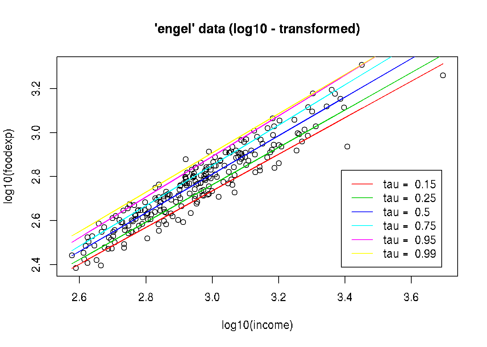

# Quantile Regression in R

*Author: Lan Wang and Ruosha Li*


## Goals

* Fit a quantile regression model in R.
* Test the significance of regression coefficients
* Creat and plot pointwise confidence intervals


## R Package quantreg
- R package quantreg (developed and maintained by Dr. Koenker).
- Documentation: https://cran.r-project.org/web/packages/quantreg/quantreg.pdf
- Type the following in R for installation:

```r
install.packages("quantreg")
```
- Then, load the package by typing:

```r
library(quantreg)
```

```
## Loading required package: SparseM
```

```
## 
## Attaching package: 'SparseM'
```

```
## The following object is masked from 'package:base':
## 
##     backsolve
```

## Fitting linear quantile regression in R

```r
rq(formula,tau,data,method,...)
```
- method="br" (default): simplex method. Efficient for problems with modest sample size (up to several thousands).
- method="fn": Frisch-Newton interior point method; more efficient than simplex for larger sample sizes;
- method="pfn": Frisch-Newton with pre-processing (suitable when n is very large). 


## Example 1: Fit quantile regression at one quantile level

-Engel food expenditure data used in Koenker and Bassett(1982). 

-This is a regression data set consisting of 235 observations on income and expenditure on food for Belgian working class households.

- income: annual household income in Belgian francs
- foodexp: annual household food expenditure


```r
data(engel) 
plot(engel, log = "xy", main = "'engel' data (log - log scale)") 
```


```r
f1<-rq(log10(foodexp) ~ log10(income), tau=0.5, data=engel)
f1
```

```
## Call:
## rq(formula = log10(foodexp) ~ log10(income), tau = 0.5, data = engel)
## 
## Coefficients:
##   (Intercept) log10(income) 
##     0.1816766     0.8765921 
## 
## Degrees of freedom: 235 total; 233 residual
```

## Example 2: Fit quantile regression at multiple quantile levels simultaneously


```r
plot(log10(foodexp) ~ log10(income), data = engel, main = "'engel' data (log10 - transformed)") 
taus <- c(.15, .25, .50, .75, .95, .99) 
rqs <- as.list(taus) 
for(i in seq(along = taus)) 
  { rqs[[i]] <- rq(log10(foodexp) ~ log10(income), tau = taus[i], data = engel) 
  lines(log10(engel$income), fitted(rqs[[i]]), col = i+1) } 
legend("bottomright", paste("tau = ", taus), inset = .04, col = 2:(length(taus)+1), lty=1)
```



## Inference on linear quantile regression in R

```r
summary.rq(fit.obj,{\tblue{se=" "}},...)
```
- se="rank": provides CI by inverting a rank score test.
- se="nid": estimation of the asymptotic variance assuming non i.i.d. errors (through sparsity estimation).
- se="iid": assumes i.i.d. errors in variance estimation.
- se="ker": variance estimated using a kernel estimate (Powell Sandwich).

## Resampling methods for inference on quantile regression 

```r
summary.rq(fit.obj,{\tblue{se="boot"}},bsmethod="")
```

- bsmethod="xy": xy-paired bootstrap.
- bsmethod="pwy": perturbing the estimating equation (Parzen, 1994)
- bsmethod="mcmb": Markov chain marginal boostrap (He and Hu, 2002), computationally efficient
for large n and p.
- bsmethod="wxy": generalized bootstrap with unit exponential weights.
- bsmethod="wild": wild bootstrap (Feng et al., 2011).


```r
f1<-rq(log10(foodexp) ~ log10(income), tau=0.5, data=engel)
summary.rq(f1, se="boot", bsmethod="xy", R=1000)
```

```
## 
## Call: rq(formula = log10(foodexp) ~ log10(income), tau = 0.5, data = engel)
## 
## tau: [1] 0.5
## 
## Coefficients:
##               Value    Std. Error t value  Pr(>|t|)
## (Intercept)    0.18168  0.10336    1.75775  0.08010
## log10(income)  0.87659  0.03540   24.76216  0.00000
```

```r
summary.rq(f1, se="boot", bsmethod="pwy", R=1000)
```

```
## 
## Call: rq(formula = log10(foodexp) ~ log10(income), tau = 0.5, data = engel)
## 
## tau: [1] 0.5
## 
## Coefficients:
##               Value    Std. Error t value  Pr(>|t|)
## (Intercept)    0.18168  0.10242    1.77390  0.07739
## log10(income)  0.87659  0.03499   25.05167  0.00000
```

## Pointwise confidence intervals


```r
tau.seq=seq(0.1,0.9,0.01)
f2 = rq(log10(foodexp) ~ log10(income),tau=tau.seq,data=engel)
sfm = summary(f2, se="rank", alpha=0.05)
```

```
## Warning in rq.fit.br(x, y, tau = tau, ci = TRUE, ...): Solution may be
## nonunique

## Warning in rq.fit.br(x, y, tau = tau, ci = TRUE, ...): Solution may be
## nonunique

## Warning in rq.fit.br(x, y, tau = tau, ci = TRUE, ...): Solution may be
## nonunique

## Warning in rq.fit.br(x, y, tau = tau, ci = TRUE, ...): Solution may be
## nonunique
```

```r
plot(sfm, mfrow=c(1,2))
```


